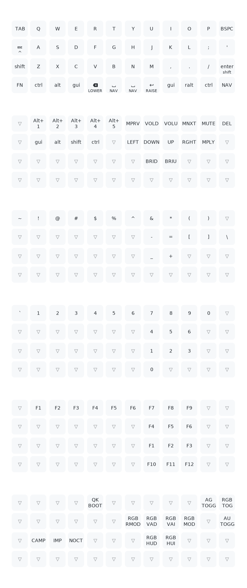

# QMK Userspace

This is a template repository which allows for an external set of QMK keymaps to be defined and compiled. This is useful for users who want to maintain their own keymaps without having to fork the main QMK repository.

## Planck layout

Automatically generated with [keymap-drawer](https://github.com/caksoylar/keymap-drawer) using Github workflows.

 

## How to configure your build targets

1. Run the normal `qmk setup` procedure if you haven't already done so -- see [QMK Docs](https://docs.qmk.fm/#/newbs) for details.
1. Fork this repository
1. Clone your fork to your local machine
1. Add a new keymap for your board using `qmk new-keymap`
    * This will create a new keymap in the `keyboards` directory, in the same location that would normally be used in the main QMK repository. For example, if you wanted to add a keymap for the Planck, it will be created in `keyboards/planck/keymaps/<your keymap name>`
    * You can also create a new keymap using `qmk new-keymap -kb <your_keyboard> -km <your_keymap>`
    * Alternatively, add your keymap manually by placing it in the location specified above.
    * `layouts/<layout name>/<your keymap name>/keymap.*` is also supported if you prefer the layout system
1. Add your keymap(s) to the build by running `qmk userspace-add -kb <your_keyboard> -km <your_keymap>`
    * This will automatically update your `qmk.json` file
    * Corresponding `qmk userspace-remove -kb <your_keyboard> -km <your_keymap>` will delete it
    * Listing the build targets can be done with with `qmk userspace-list`
1. Commit your changes

## How to build locally

1. Run `git submodule update --init --recursive` (first time after repo was cloned)
1. Run the `./setup_qmk.sh` script. It runs `qmk setup` and sets the global userspace path `qmk config user.overlay_dir="$(realpath .)"`) 
1. Compile normally: `qmk compile -kb your_keyboard -km your_keymap` or `make your_keyboard:your_keymap`

If build targets are configured as shown above, use `qmk userspace-compile` to build all of your userspace targets at once.

